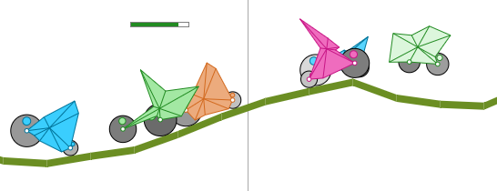
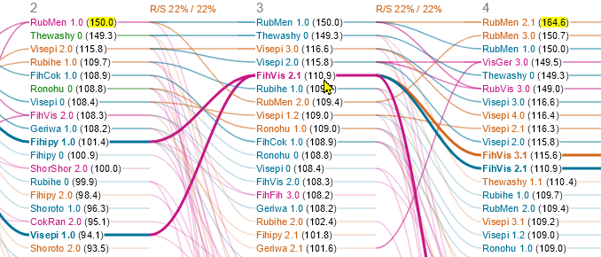
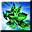

# Genetic Cars

## Background

This application is based on the idea of the open-source project [HTML5 Genetic Algorithm 2D Car Thingy](https://rednuht.org/genetic_cars_2/).
The linked project is implemented as a web application in JavaScript. As a C# developer, I was keen to develop a similar application from scratch as a .NET application.

The program demonstrates a genetic algorithm in a playful way as evolving cars. It is a desktop application based on [Windows Forms .NET](https://learn.microsoft.com/en-us/dotnet/desktop/winforms/overview/?view=netdesktop-8.0), the [SkiaSharp](https://github.com/mono/SkiaSharp) 2D graphics API and the physics engine [Aether.Physics2D](https://nkast.github.io/Aether.Physics2D/).

## How It Works
First a bunch of random cars is created (you can choose the population size between 8 and 200 with a slider).
Cars are determined by a set of nineteen parameters or genes.
- 12 genes determine the shape of the chassis.
- 2 genes determine where the wheels are attached to the chassis.
- 2 genes determine the radius of the wheels.
- 3 genes determine the density of the wheels and the chassis. Denser parts appear darker.

The cars are dropped onto a track and begin racing. The terrain is almost flat at the beginning and becomes increasingly bumpy and steep.
The cars that make it the furthest win.

- The best 25% of the cars are called "elite". They are the survivors and are the basis of the next generation (blue).
- The next 25% of the new generation will emerge from this elite, crossed with cars from the top 50% of the population (red/violet).
- The next 25% of the new generation is created from mutations of the elite (orange).
- The last 25% of the new generation is generated from new random cars (green).

## Names
Every car creation is assigned a random name and a number, e.g., "Fixilo 3.12". The part before the decimal point is the generation number.
New, random cars have generation zero.

For mutated cars, this number is increased by one.

For crossbreed cars, this is the maximum generation number of their two ancestors + 1.
They are also assigned a new name made up of the first halves of the ancestral names.

The part after the decimal point has no special meaning and gives cars a unique identity.

To display the names in the simulation, you can activate the corresponding check box.

## Family Tree
Below the simulation a family tree is displayed.

You can move the mouse cursor over a car name to highlight its ancestors and descendants. Clicking a name makes the selection permanent - until you click on another name or click the same name again.

With Ctrl+Mouse-Wheel you can zoom the family tree in or out.

## God Commands
The following commands as well as changed population sizes, mutation rates and sizes become only effective when the new generation is created.

-  Change the floor at every race round.
-  Mutates elite cars (first 25% of the population) having run similar distances, keeping only the best one of a group unmutated.
-  Replaces cars having similar genes with new, random creations, keeping only the best one of a group as is. This command affects 50% of the population stating after the elite.
-  This command is very radical and keeps only the best car of each family name (i.e., the name without the number). Empty positions are filled with new, random cars.

## What Else?
 GeneticCars is a free and open-source software licensed under the AGPL.

 Have fun!
